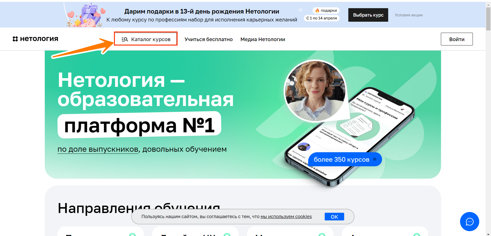

# Домашнее задание к занятию «4.2. Заключительная лекция»

__План автоматизации тестирования:__  
I. Перечень автоматизируемых сценариев.  
II. Перечень используемых инструментов с обоснованием выбора.  
III. Перечень необходимых разрешений, данных и доступов.  
IV. Перечень и описание возможных рисков при автоматизации.  
V. Перечень необходимых специалистов для автоматизации.  
VI. Интервальная оценка с учётом рисков в часах.  
__Виды тестирования:__  
Ручное(проверка работы в ручную, без использования програмных средств) и автоматическое(применение специально написанных тестов).  Подойдет метод серого ящика - нам не нужен весь код и доступ к сайту.
__Уровни тестирования:__  
Модульное тестирование - проверка корректности работы отдельных модулей или компонентов программы.
## I. Перечень автоматизируемых сценариев.
### Сценарии перехода к форме записи
*Шаги: открыть веб-сайт [Нетология](https://netology.ru/?utm_source=yandex&utm_medium=cpc&utm_campaign=brand_all_ou_ya_retarget_abtest_2023&utm_content=15614341496&utm_term=%D0%BD%D0%B5%D1%82%D0%BE%D0%BB%D0%BE%D0%B4%D0%B6%D0%B8&yclid=4791452060354347007).*  
**Сценарий 1.1. Каталог курсов в честь 13го день рождения Нетологии (Временная акция) (первый способ).**
1) Переход с хедера страницы в каталог курсов в честь дня рождения Нетологии (временная акция).
   
2) В открывшемся [каталоге](https://netology.ru/navigation?utm_campaign=brand_all_ou_birthday_netology_main_desktop&utm_source=triggers&utm_medium=block) ищем курс по профессии "Тестировщик ПО". Выбираем его.
   

**Сценарий 1.2. Каталог курсов в честь 13го день рождения Нетологии (Временная акция) (второй способ).**
1) Переход с хедера страницы в каталог курсов в честь дня рождения Нетологии (временная акция).
   
2) В открывшемся [каталоге](https://netology.ru/navigation?utm_campaign=brand_all_ou_birthday_netology_main_desktop&utm_source=triggers&utm_medium=block) набрать в поисковой строке "Тестировщик ПО". В отобразившихся курсах (ниже) выбираем его.
   

**Сценарий 1.3. Каталог курсов в честь 13го день рождения Нетологии (Временная акция) (третий способ).**
1) Переход с хедера страницы в каталог курсов в честь дня рождения Нетологии (временная акция).
   
2) В открывшемся [каталоге](https://netology.ru/navigation?utm_campaign=brand_all_ou_birthday_netology_main_desktop&utm_source=triggers&utm_medium=block) набрать в поисковой строке "Тестировщик ПО"и кликнуть по кнопке "Найти курс".
   
3) В открывшемся [каталоге](https://netology.ru/navigation?utm_campaign=brand_all_ou_birthday_netology_main_desktop&utm_source=triggers&utm_medium=block) ищем курс по профессии "Тестировщик ПО". Выбираем его.
   

**Сценарий 2.1. Поиск профессии через поисковую систему в каталоге, расположенному в хеддере страницы (первый способ)**
1) Переход с хедера страницы в каталог курсов.
   
2) В открывшейся поисковой системе набрать необходимый нам курс (Тестировщик ПО).
   
3) Кликнуть ниже поисковой системы по радиокнопке профессии "Тестировщик ПО".

**Сценарий 2.2. Поиск профессии через поисковую систему в каталоге, расположенному в хеддере страницы (второй способ)**
1) Переход с хедера страницы в каталог курсов.
   
2) В открывшейся поисковой системе набрать начальные слова необходимого нам курса "тес"(Тестировщик ПО).
3) Кликнуть по кнопке "Найти курс".
   
4) В открывшемся [каталоге](https://netology.ru/navigation?query=%D1%82%D0%B5%D1%81) ищем курс по профессии "Тестировщик ПО". Выбираем его.
   

**Сценарий 2.3. Поиск профессии с помощью радиокнопок "Направления обучения" в каталоге, расположенному в хеддере страницы.**
1) Переход с хедера страницы в каталог курсов.
   
2) В открывшихся направлениях по обучению нажать на радиокнопку "Все курсы", либо "Программирование".
   
3) В открывшемся [каталоге](https://netology.ru/navigation?utm_campaign=brand_all_ou_birthday_netology_main_desktop&utm_source=triggers&utm_medium=block) ищем курс по профессии "Тестировщик ПО". Выбираем его.
   

**Сценарий 3.1. Поиск профессии с помощью виджета "Направления обучения" (первый способ).**
1) Из списка "Направления обучения" выбираем "Программирование"
   
2) В открывшемся [каталоге](https://netology.ru/navigation?utm_campaign=brand_all_ou_birthday_netology_main_desktop&utm_source=triggers&utm_medium=block) ищем курс по профессии "Тестировщик ПО". Выбираем его.
   

**Сценарий 3.2. Поиск профессии с помощью виджета "Направления обучения" (второй способ).**
1) Из списка "Направления обучения" выбираем "Программирование"
   
2) В открывшемся [каталоге](https://netology.ru/navigation?utm_campaign=brand_all_ou_birthday_netology_main_desktop&utm_source=triggers&utm_medium=block) набрать в поисковой строке "Тестировщик ПО". В отобразившихся курсах (ниже) выбираем его.
   

**Сценарий 3.3. Поиск профессии с помощью виджета "Направления обучения" (третий способ).**
1) Из списка "Направления обучения" выбираем "Программирование"
   
2) В открывшемся [каталоге](https://netology.ru/navigation?utm_campaign=brand_all_ou_birthday_netology_main_desktop&utm_source=triggers&utm_medium=block) набрать в поисковой строке "Тестировщик ПО"и кликнуть по кнопке "Найти курс".
   
3) В открывшемся [каталоге](https://netology.ru/navigation?utm_campaign=brand_all_ou_birthday_netology_main_desktop&utm_source=triggers&utm_medium=block) ищем курс по профессии "Тестировщик ПО". Выбираем его.
   

**Сценарий 4.1. Поиск профессии с помощью виджета "Направления обучения" (первый способ).**
1) Из списка "Направления обучения" кликнуть по радиокнопке "Полный каталог".
 
2) В открывшемся [каталоге](https://netology.ru/navigation?utm_campaign=brand_all_ou_birthday_netology_main_desktop&utm_source=triggers&utm_medium=block) ищем курс по профессии "Тестировщик ПО". Выбираем его.
   

**Сценарий 4.2. Поиск профессии с помощью виджета "Направления обучения" (второй способ).**
1) Из списка "Направления обучения" кликнуть по радиокнопке "Полный каталог".
 
2) В открывшемся [каталоге](https://netology.ru/navigation?utm_campaign=brand_all_ou_birthday_netology_main_desktop&utm_source=triggers&utm_medium=block) набрать в поисковой строке "Тестировщик ПО". В отобразившихся курсах (ниже) выбираем его.
   

**Сценарий 4.3. Поиск профессии с помощью виджета "Направления обучения" (третий способ).**
1) Из списка "Направления обучения" кликнуть по радиокнопке "Полный каталог".
 
2) В открывшемся [каталоге](https://netology.ru/navigation?utm_campaign=brand_all_ou_birthday_netology_main_desktop&utm_source=triggers&utm_medium=block) набрать в поисковой строке "Тестировщик ПО"и кликнуть по кнопке "Найти курс".
   
3) В открывшемся [каталоге](https://netology.ru/navigation?utm_campaign=brand_all_ou_birthday_netology_main_desktop&utm_source=triggers&utm_medium=block) ищем курс по профессии "Тестировщик ПО". Выбираем его.
   

**Сценарий 5.1. Поиск профессии в футере веб-сайта Нетологии(первый способ).**
1) Переход с футера страницы в каталог курса по направлениям(любой на выбор): 
   а) Каталог курсов;
   б) Популярные курсы;
   в) Программирование.
   
2) В открывшемся [каталоге](https://netology.ru/navigation?utm_campaign=brand_all_ou_birthday_netology_main_desktop&utm_source=triggers&utm_medium=block) ищем курс по профессии "Тестировщик ПО". Выбираем его.
   

**Сценарий 5.2. Поиск профессии в футере веб-сайта Нетологии(второй способ).**
1) Переход с футера страницы в каталог курса по направлениям(любой на выбор):   
   а) Каталог курсов;  
   б) Популярные курсы;  
   в) Программирование.  
   
2) В открывшемся [каталоге](https://netology.ru/navigation?utm_campaign=brand_all_ou_birthday_netology_main_desktop&utm_source=triggers&utm_medium=block) набрать в поисковой строке "Тестировщик ПО". В отобразившихся курсах (ниже) выбираем его.  
   

**Сценарий 5.3. Поиск профессии в футере веб-сайта Нетологии(третий способ).**
1) Переход с футера страницы в каталог курса по направлениям(любой на выбор):   
   а) Каталог курсов;  
   б) Популярные курсы;  
   в) Программирование.  
   
2) В открывшемся [каталоге](https://netology.ru/navigation?utm_campaign=brand_all_ou_birthday_netology_main_desktop&utm_source=triggers&utm_medium=block) набрать в поисковой строке "Тестировщик ПО"и кликнуть по кнопке "Найти курс".  
   
3) В открывшемся [каталоге](https://netology.ru/navigation?utm_campaign=brand_all_ou_birthday_netology_main_desktop&utm_source=triggers&utm_medium=block) ищем курс по профессии "Тестировщик ПО". Выбираем его.  
   

### Сценарии записи на курс "Тестировщик ПО".
***Шаги: открыть страницу [записи на курс](https://netology.ru/programs/qa#/).***
 **Сценарий №1:** В начале страницы нажимаем кнопку "Записаться". 
  
 **Сценарий №2:** Немного прокрутив страницу вниз, в хедере страницы появляется кнопка "Записаться", нажать на нее.  
 
 _Итог сценария №1 и №2 - после нажатия на кнопку "Записаться" - страница автоматически перемещается в футер - раздел формы для записи._
 **Сценарий №3:** Опуститься в футер страницы к форме записи на курс.
 

 ### Сценарии заполнения и отправки форм на курс "Тестировщик ПО".  
 ***Шаги: открыть страницу [записи на курс](https://netology.ru/programs/qa#/) и выполнить любой из предыдущих сценариев.***  
 **Сценарий №1. Позитивный сценарий:**
 1) Заполнить поле "Имя" валидными данными.
 - Не менее 2 символов;
 - Символы должны содержать кириллицу и латиницу, допускаются дефисы и пробелы;
 - Не более 61 символов (по факту граничных значений нет).
 2) Заполнить поле "Телефон" корректными данными.
 - тестирование будет проводиться номерами российского региона;
 - поле должно содержать только цифры;
 - поле должно содержать только не менее 11 и не более 14.
 3) Заполнить поле "Электронная почта" корректными данными.
 - имя почтового ящика может содержать латиницу, спецсимволы, цифры;
 - имя почтового ящика должно содержать имя (Martin), символа "собака"(@), домена (mail), точки (.), кода страны (ru) - Martin@mail.ru (пример);
 - не должно быть пробелов;
 - знак @ после имени почтового ящика (перед доменом, где расположена почта);
 - должна быть точка . после названия домена и перед кодом страны;
 1) Нажать на кнопку "Записаться".
   
Ожидаемый результат: всплывает модальное окно "Запись прошла успешно! Вам скоро позвонит наш специалист".  

**Сценарий №2. Ввод одного валидного символа в поле "Имя".**
1) Заполнить поле "Имя" одним символом.
2) Заполнить поле "Телефон" корректными данными.
3) Заполнить поле "Электронная почта" корректными данными.
4) Нажать на кнопку "Записаться".
    
Ожидаемый результат: ниже поля "Имя" всплывает сообщение красного цвета "Должно быть не короче 2 символов".

**Сценарий №3. Запись на курс с пустым полем "Имя".**
1) Оставить поле "Имя" пустым.
2) Заполнить поле "Телефон" корректными данными.
3) Заполнить поле "Электронная почта" корректными данными.
4) Нажать на кнопку "Записаться".
   
Ожидаемый результат: ниже поля "Имя" появляется сообщение красного цвета "Обязательное поле".

**Сценарий №4. Ввод 62 символа в поле "Имя".**
1) В поле "Имя" ввести 62 символа.
2) Заполнить поле "Телефон" корректными данными.
3) Заполнить поле "Электронная почта" корректными данными.
4) Нажать на кнопку "Записаться".
Ожидаемый результат: ниже поля "Имя" появляется сообщение красного цвета "Не более 61 символа".

**Сценарий №5. Ввод спецсимволов в поле "Имя".**
1) В поле "Имя" ввести спецсимволы.
2) Заполнить поле "Телефон" корректными данными.
3) Заполнить поле "Электронная почта" корректными данными.
4) Нажать на кнопку "Записаться".
Ожидаемый результат: ниже поля "Имя" появляется сообщение красного цвета "Должно состоять из букв".

**Сценарий №6. Ввод валидных данных в поле "Имя" с цифрой.**
1) В поле "Имя" ввести валидные данные, в конце имени поставить любую цифру.
2) Заполнить поле "Телефон" корректными данными.
3) Заполнить поле "Электронная почта" корректными данными.
4) Нажать на кнопку "Записаться".
    
Ожидаемый результат: ниже поля "Имя" появляется сообщение красного цвета "Должно состоять из букв".

**Сценарий №7. Запись на курс с пустым номером телефона.**
1) Заполнить поле "Имя" валидными данными.
2) Оставить поле "Телефон пустым".
3) Заполнить поле "Электронная почта" корректными данными.
4) Нажать на кнопку "Записаться". 
      
Ожидаемый результат: ниже поля "Телефон" появляется сообщение красного цвета "Обязательное поле".

**Сценарий №8. Ввод в поле "Телефон" невалидных символов**
1) Заполнить поле "Имя" валидными данными.
2) Заполнить поле "Телефон" любыми символами, кроме цифр.
3) Заполнить поле "Электронная почта" корректными данными.
4) Нажать на кнопку "Записаться".
      
Ожидаемый результат: ввод не осуществляется. Ниже поля "Телефон" появляется сообщение красного цвета "Обязательное поле".

**Сценарий №9. Ввод неполного номера-кода страны в поле "Телефон"**
1) Заполнить поле "Имя" валидными данными.
2) Заполнить в поле "Телефон" код страны.
3) Заполнить поле "Электронная почта" корректными данными.
4) Нажать на кнопку "Записаться".
      
Ожидаемый результат: ниже поля "Телефон" появляется сообщение красного цвета "Неверный формат".

**Сценарий №10. Ввод неполного номера телефона**
1) Заполнить поле "Имя" валидными данными.
2) Заполнить в поле "Телефон" 10 цифр.
3) Заполнить поле "Электронная почта" корректными данными.
4) Нажать на кнопку "Записаться".
      
Ожидаемый результат: ниже поля "Телефон" появляется сообщение красного цвета "Неверный формат".

**Сценарий №11. Ввод верхнего граничного значения в поле "Телефона".**
1) Заполнить поле "Имя" валидными данными.
2) Заполнить в поле "Телефон" 15 цифр.
3) Заполнить поле "Электронная почта" корректными данными.
4) Нажать на кнопку "Записаться".
      
Ожидаемый результат: ниже поля "Телефон" появляется сообщение красного цвета "Неверный формат".

**Сценарий №12. Запись на курс с пустым полем "Электронная почта.**
1) Заполнить поле "Имя" валидными данными.
2) Заполнить поле "Телефон" корректными данными.
3) Оставить поле "Электронная почта" пустым.
4) Нажать на кнопку "Записаться".
       
Ожидаемый результат: ниже поля "Электронная почта" появляется сообщение красного цвета "Обязательное поле".

**Сценарий №13. Запись на курс с пустым полем "Электронная почта.**
1) Заполнить поле "Имя" валидными данными.
2) Заполнить поле "Телефон" корректными данными.
3) Оставить поле "Электронная почта" пустым.
4) Нажать на кнопку "Записаться".
       
Ожидаемый результат: ниже поля "Электронная почта" появляется сообщение красного цвета "Обязательное поле".

**Сценарий №14. Ввод почтового ящика без символа @**
1) Заполнить поле "Имя" валидными данными.
2) Заполнить поле "Телефон" корректными данными.
3) Заполнить поле "Электронная почта" без символа @.
4) Нажать на кнопку "Записаться".
       
Ожидаемый результат: ниже поля "Электронная почта" появляется сообщение красного цвета "Неверный email".

**Сценарий №15. Ввод валидных данных в поле "Электронная почта" с пробелом.**
1) Заполнить поле "Имя" валидными данными.
2) Заполнить поле "Телефон" корректными данными.
3) Заполнить поле "Электронная почта" валидными данными, с пробелом посередине.
4) Нажать на кнопку "Записаться".
       
Ожидаемый результат: ниже поля "Электронная почта" появляется сообщение красного цвета "Неверный email".

**Сценарий №16. Ввод валидных данных в поле "Электронная почта" без кода страны.**
1) Заполнить поле "Имя" валидными данными.
2) Заполнить поле "Телефон" корректными данными.
3) Заполнить поле "Электронная почта" валидными данными без кода страны.
4) Нажать на кнопку "Записаться".
       
Ожидаемый результат: ниже поля "Электронная почта" появляется сообщение красного цвета "Неверный email".

**Сценарий №17. Ввод валидных данных в поле "Электронная почта" без имени почтового ящика.**
1) Заполнить поле "Имя" валидными данными.
2) Заполнить поле "Телефон" корректными данными.
3) Заполнить поле "Электронная почта" валидными данными без имени почтового ящика.
4) Нажать на кнопку "Записаться".
       
Ожидаемый результат: ниже поля "Электронная почта" появляется сообщение красного цвета "Неверный email".

**Сценарий №18. Ввод кириллицы в названии почтового ящика.**
1) Заполнить поле "Имя" валидными данными.
2) Заполнить поле "Телефон" корректными данными.
3) Заполнить поле "Электронная почта" кириллицей.
4) Нажать на кнопку "Записаться".
Ожидаемый результат: ниже поля "Электронная почта" появляется сообщение красного цвета "Неверный email".
Фактический результат: данные заполняются.

## II. Перечень используемых инструментов с обоснованием выбора. 
 - OC: Windows 10 Pro, Выпуск 22H2 - стандартная операционная система, можно использовать другую.
 - Браузер: Google Chrome, Microsoft Edge - стандартные браузера, можно использовать другие.
 - Язык программирования: Java - openjdk version "11.0.22" - язык общего назначения, который преимущественно используется в корпоративных приложениях, веб-сервисах, комплексных данны(обработка больших данных, систем очередей) и т.д.
 - Система контроля версий: Git - это система для управления версиями исходного кода программ. Другие аналогичные версии необходимо долго усваивать, изучать.
 - Платформа для хостинга проекта: GitHub - веб-сервис, который основан на системе Git. Это такая социальная сеть для разработчиков, которая помогает удобно вести коллективную разработку IT-проектов. Здесь можно публиковать и редактировать свой код, комментировать чужие наработки, следить за новостями других пользователей.
 - Редактор кода: IntelliJ IDEA 2023.3.2 - интегрированная среда разработки программного обеспечения для многих языков программирования, в частности Java.
 - Система для автоматизации сборки и сбора статистики: Gradle - позволяет удобно настраивать статистики.
 - Библиотеки для генерации данных: Lombok - библиотека для Java, которая позволяет сократить шаблонный код и упростить написание кода. Она автоматически генерирует код, который обычно пишется вручную, например геттеры, сеттеры, конструкторы и методы toString().
 - Репозитарий для артефактов: mavenCentral - централизованный репозитарий, который содержит миллионы артефактов из тысяч проектов с открытым исходным кодом и коммерческих организаций, надежная и стабильная платформа.
 - Кодировка символов: UTF-8 - Gradle по умолчанию использует эту систему кодировки.
 - Модуль для юнит-тестирования: junit-jupiter - JUnit — фреймворк для автоматического юнит-тестирования приложений. Он содержит специальные функции и правила, которые позволяют легко писать и запускать тесты, то есть проверять, что каждый блок кода, или модуль, ответственный за определённую функцию программы, работает как надо. JUnit Jupiter — модуль, который предоставляет API на основе аннотаций и позволяет работать с модульными и динамическими тестами.
 - Версия JUnit: JUnit 5 - последняя версия, простой инструмент и относительно свежий.
 - Библиотека для написания лаконичных и стабильных UI-тестов: Selenide - это фреймворк для автоматизированного тестирования веб-приложений на основе Selenium WebDriver, дающий следующие преимущества: изящный API, стабильные тесты, мощные селекторы, простая конфигурация. Нам не придётся заморачиваться со всеми этими техническими подробностям, на которые обычно тестировщики-автоматизаторы тратят так много времени: нюансы работы с браузерами, типичные проблемы с таймингом и аяксом.
 - Для удобства проектирования использовать паттерн: Page Object - с его помощью мы напишем автотесты, которые будут абстрагироваться от отдельных HTML страницах.
 - Инструмент для репортинга: Allure - удобный и понятный инструмент для репортинга, интерфейс которого будет понятен всем.
 - Интеграция проектов (CI): Github Actions - возможности безграничны: непрерывная интеграция с проектом, оповещение по электронной почте и т.д.
 - Виртуальные машины: Docker-compose - это инструментальное средство, входящее в состав Docker. Оно предназначено для решения задач, связанных с развёртыванием проектов.
 - Система управления базами данных (СУБД): MySQL - предназначена для работы с базами реляционного типа и использует для взаимодействия с ними язык стандартизированных запросов (SQL).
 - Сервис для тестирования API: Postman - удобно отправлять HTTP запросы, создание тестов для для проверки ответов от сервера.

## III. Перечень необходимых разрешений, данных и доступов.
- Необходимо разрешение на проведение тестирования на веб-сайте Нетология.
- Получение тестового задания для тестирования.
- Получение джарников для автоматического тестирования.
- Доступ к чтению базы данных.
- Доступ к тестовым данным(номера телефонов и т.п.)

## IV. Перечень и описание возможных рисков при автоматизации.
- Информация может быть не актуальна к определенному времени. Например: временные акции, какие то данные могут быть удалены-изменены через какое то время, и т.п.
- Заявка на запись курса "Тестировщик ПО" может уйти к работнику Нетологии, как реальная заявка.
- Может быть увеличена нагрузка на сервер.

## V. Перечень необходимых специалистов для автоматизации.
  Тестирощик ПО (автоматизатор). Подойдет стажер, под руководством тестировщика уровня midle.

## VI. Интервальная оценка с учётом рисков в часах.  
В общем 32 часа (4 рабочих дня) для тестировщика-стажера.
- ручное тестирование - 8 часов (целый рабочий день).
- автоматическое тестирование - 24 часа (3 рабочих дня).
  

